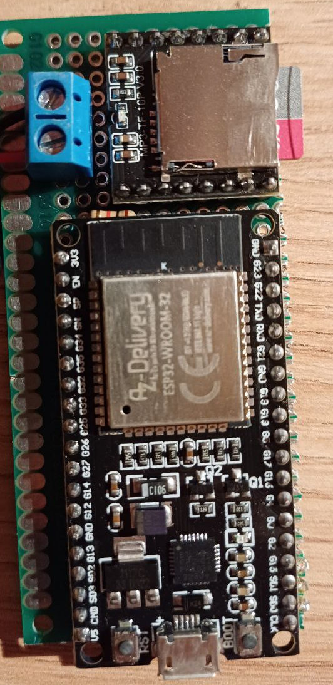
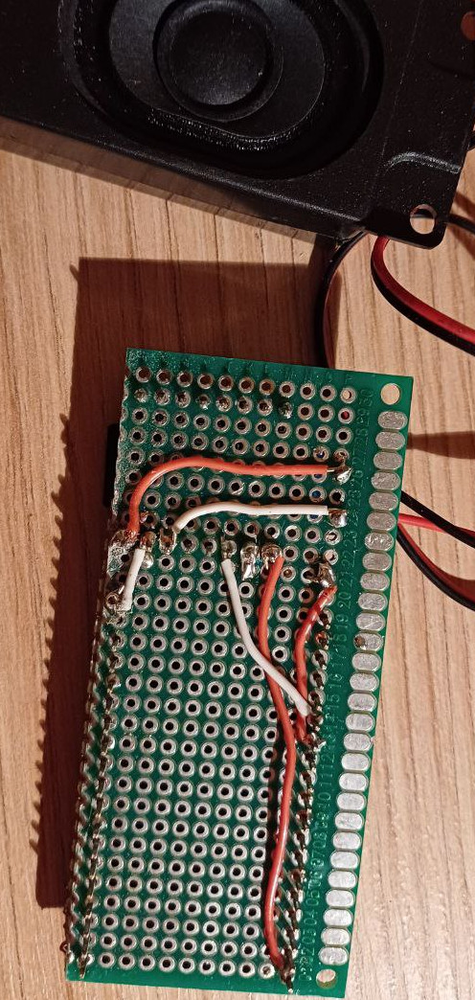
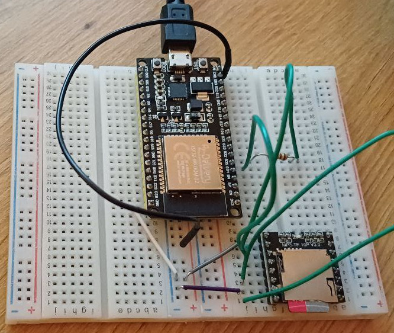
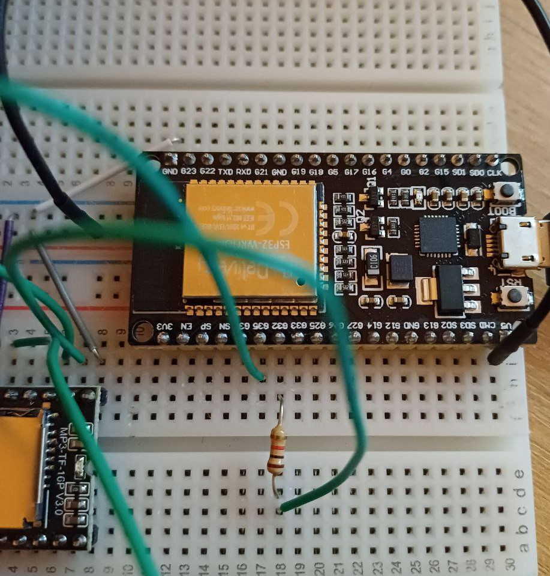

# Gong

## Idea

A device which is
- low-cost
- low-energy
- easy to use (no encryption, no cloud, no internet)
- play pre-defined sounds via web-request

## How to use

<table>
  <tr>
    <td>play first track with maximum loudness</td>
    <td>192.168.0.29/gong&loudness=30&index=1</td>
  </tr>
  <tr>
    <td>play second track with reduced loudness</td>
    <td>192.168.0.29/gong&index=2&loudness=10</td>
  </tr>
  <tr>
    <td>play first track with reduced loudness</td>
    <td>192.168.0.29/gong&index=1&loudness=10</td>
  </tr>
</table>

## Hardware:

- [**DFPlayer Mini**: SD card reader, player, amplifier and DAC](https://www.az-delivery.de/products/mp3-player-modul)
- [**ESP32 NodeMCU**: Microcontroller, power supply and WIFI interface (I'm sure any WIFI-capable Arduino-like board will do)](https://www.az-delivery.de/products/esp32-developmentboard)
- [**Speaker**](https://www.az-delivery.de/en/products/2-stuck-dfplayer-mini-3-watt-8-ohm-mini-lautsprecher-mit-jst-ph2-0-mm-pin-schnittstelle-fur-arduino-raspberry-pi-und-elektronische-diy-projekte-inklusive-e-book)

